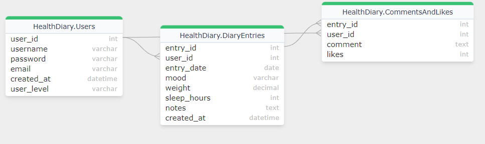

# hyte-server back-end server

Node.Js + Express

Start dev server: `npm run dev`

<h3><b>Usage<b></h3>

1. Clone/download code.
2. Run `npm i` inside the project folder
3. Install & start Mysql/MariaDB server
4. Import database script in `db/` folder
5. Create .env file based on .env.sample
6. Start the dev server: npm run dev/npm run start

<h3><b>/api/auth<b></h3>
example queries

```

  # Login
  POST https://hyte-servu.northeurope.cloudapp.azure.com/api/users/login
  content-type: application/json
  {
    "username": "johnDoe4",
    "password": "Hashed_password4"
  }

  ## Get user by token (requires token)
  GET https://hyte-servu.northeurope.cloudapp.azure.com/api/auth/me
  Authorization: Bearer <token>

```

<h3><b>/api/users<b></h3>

example queries

```
  # Get user by id (requires token)
  GET https://hyte-servu.northeurope.cloudapp.azure.com/api/users/:id
  Authorization: Bearer <token>

  # Create user (register)
  POST https://hyte-servu.northeurope.cloudapp.azure.com/api/users
  content-type: application/json

  {
    "username": "testikayttaja",
    "password": "12345678",
    "email": "testi@email.com"
  }

```

<h3><b>/api/entries<b></h3>

example queries

```

# Get entries by id
GET https://hyte-servu.northeurope.cloudapp.azure.com/api/entries/:id

# Post entry
https://hyte-servu.northeurope.cloudapp.azure.com/api/entries
content-type: application/json


{
  "user_id": 9,
  "entry_date": "2024-03-17",
  "mood": "Sad",
  "weight": .6,
  "sleep_hours": 7,
  "notes": "This was a good day"

}

# Delete entry
DELETE https://hyte-servu.northeurope.cloudapp.azure.com/api/entries" + id
```

<h3><b>Database structure<b></h3>



<h3><b>Frontend UI<b></h3>

 <br>

 <br>

 <br>

 <br>

 <br>

 <br>

<h3><b>Known bugs:<b></h3>

1. Delete entrry function not yet working from the page, will be fixed as soon as possible.

Please report any other odd behavior on the page, I will try to patch them as well as I can.

<h3><b>Refrences:<b></h3>
