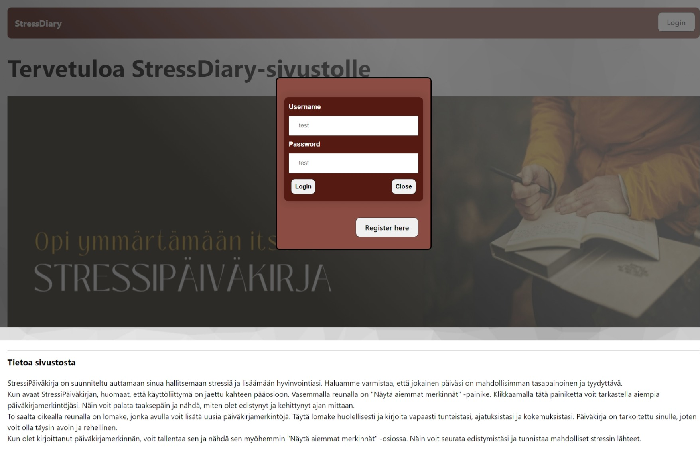
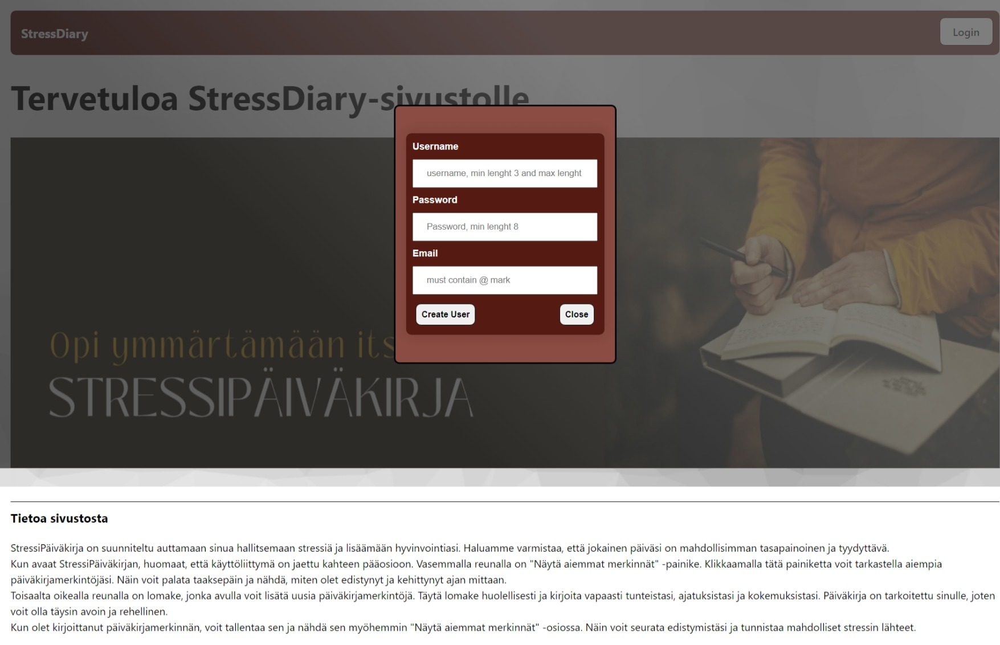

# hyte-server back-end server
Node.Js + Express

Start dev server: `npm run dev`
<h3><b>Usage<b></h3>

1. Clone/download code.
2. Run ```npm i``` inside the project folder
3. Install & start Mysql/MariaDB server
4. Import database script in ```db/``` folder
5. Create .env file based on .env.sample
6. Start the dev server: npm run dev/npm run start


<h3><b>/api/auth<b></h3>
example queries

```

  # Login
  POST https://hyte-server-aura.northeurope.cloudapp.azure.com/api/users/login
  content-type: application/json
  {
    "username": "johnDoe4",
    "password": "Hashed_password4"
  }

  ## Get user by token (requires token)
  GET https://hyte-server-aura.northeurope.cloudapp.azure.com/api/auth/me
  Authorization: Bearer <token>

```
<h3><b>/api/users<b></h3>

example queries

```
  # Get all users (requires token)
  GET https://hyte-server-aura.northeurope.cloudapp.azure.com/api/users
  Authorization: Bearer <token>

  # Get user by id (requires token)
  GET https://hyte-server-aura.northeurope.cloudapp.azure.com/api/users/:id
  Authorization: Bearer <token>

  # Delete user (requires token)
  DELETE https://hyte-server-aura.northeurope.cloudapp.azure.com/api/users/:id
  Authorization: Bearer <token>

  # Create user (register)
  POST https://hyte-server-aura.northeurope.cloudapp.azure.com/api/users
  content-type: application/json

  {
    "username": "johndoe4",
    "password": "hashed_password4",
    "email": "email@email.com"
  }

  # Update user's own data (requires token)
  PUT https://hyte-server-aura.northeurope.cloudapp.azure.com/api/users/
  Authorization: Bearer <token>
  content-type: application/json

  {
    "username": "johndoe4",
    "password": "hashed_password4",
    "email": "email@email.com"
  }
```


<h3><b>/api/entries<b></h3>

example queries
```
# Get all entries for a logged in user (requires token)
GET https://hyte-server-aura.northeurope.cloudapp.azure.com/api/entries
Authorization: Bearer <token>

# Get entries by id
GET https://hyte-server-aura.northeurope.cloudapp.azure.com/api/entries/:id

# Post entry
POST https://hyte-server-aura.northeurope.cloudapp.azure.com/api/entries
content-type: application/json


{
  "user_id": 9,
  "entry_date": "2024-03-17",
  "mood": "Sad",
  "weight": .6,
  "sleep_hours": 7,
  "notes": "This was a good day"

}

# Update entry
PUT https://hyte-server-aura.northeurope.cloudapp.azure.com/entries/:id
content-type: application/json

{
  "user_id": 9,
  "entry_date": "2024-17-03",
  "mood": "Happy",
  "weight": 80.2,
  "sleep_hours": 9,
  "notes": "This was a ok day, sleep was good though",

}

# Delete entry
DELETE https://hyte-server-aura.northeurope.cloudapp.azure.coma/api/entries/:id
```
<h3><b>Database structure<b></h3>


<h3><b>Frontend UI<b></h3>







<h3><b>Known bugs:<b></h3>


1. Delete user function not yet working from the page, will be fixed as soon as possible.

Please report any other odd behavior on the page, I will try to patch them as well as I can.

<h3><b>Refrences:<b></h3>


